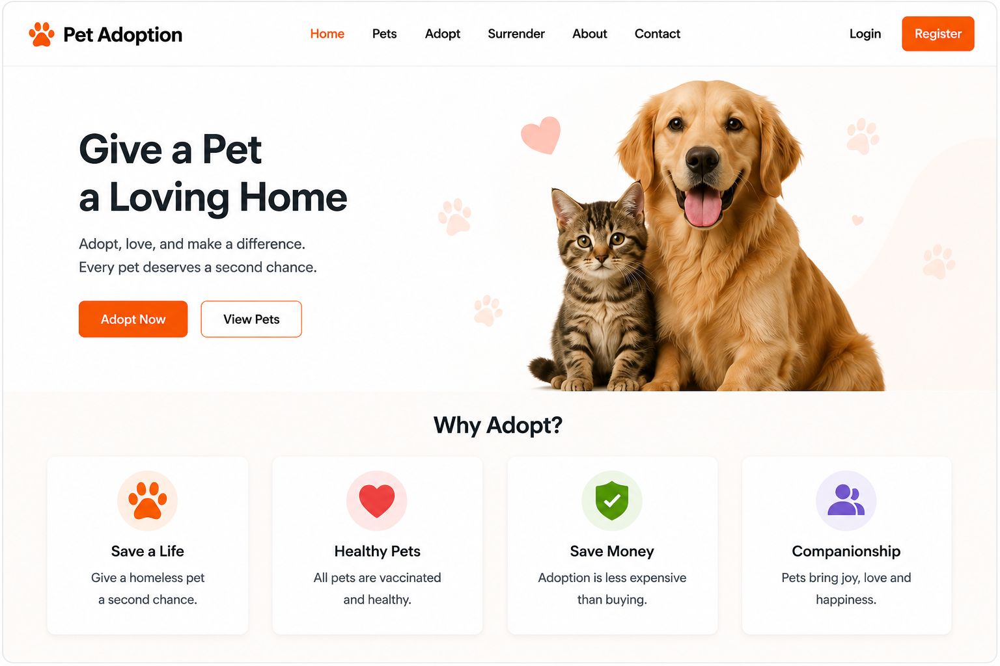
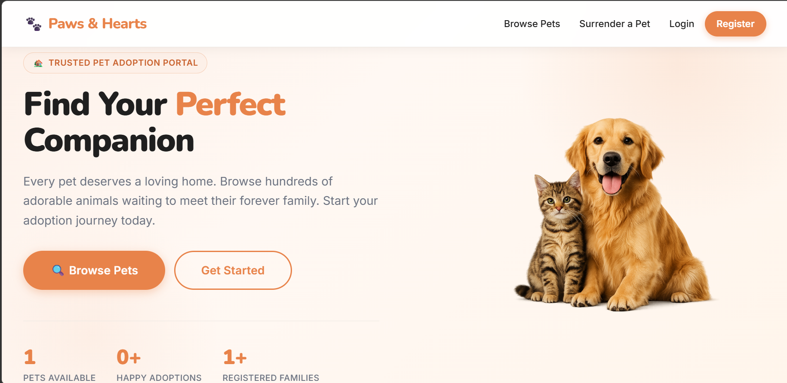
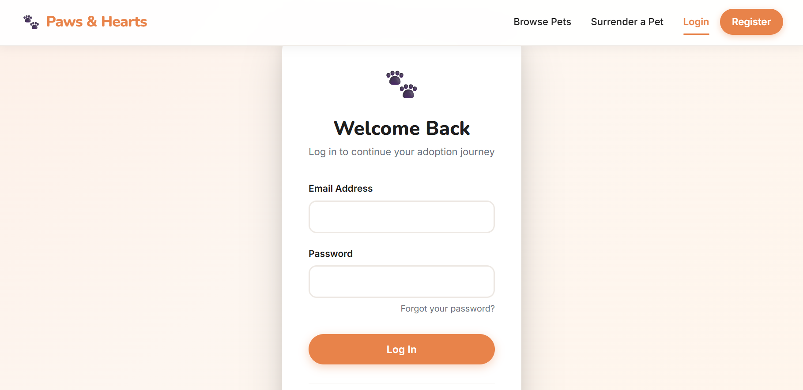
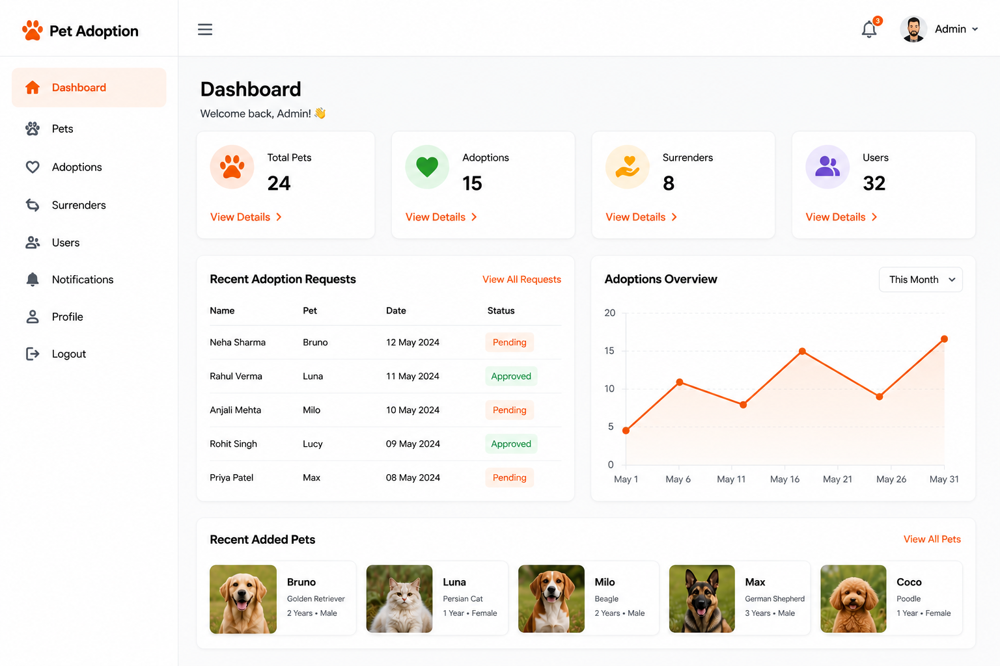

# 🐾 Pet Adoption and Management System

<p align="center">
  
</p>

<p align="center">
A modern full-stack Pet Adoption and Management web application built with <strong>Django</strong> that simplifies the pet adoption process by allowing users to browse pets, submit adoption requests, surrender pets for adoption, and receive email notifications, while administrators can efficiently manage pets and adoption requests through a dedicated dashboard.
</p>

---

## 🌟 Key Features

- 🔐 Secure User Authentication (Register/Login/Logout)
- 🐶 Browse Available Pets
- ❤️ Submit Pet Adoption Requests
- 📦 Pet Surrender Management
- 📧 Email Notifications
- 📊 Admin Dashboard
- 📝 Adoption Request Tracking
- 📱 Responsive User Interface
- 🔍 Easy Navigation and Search

---

## 🛠️ Tech Stack

| Category | Technologies |
|----------|--------------|
| **Backend** | Django, Python |
| **Frontend** | HTML, CSS, JavaScript |
| **Database** | SQLite |
| **Authentication** | Django Authentication |
| **Email Service** | SMTP |
| **Version Control** | Git & GitHub |

---

# 📸 Application Screenshots

## 🏠 Home Page

<p align="center">
  
</p>

---

## 🔐 Login Page

<p align="center">
  
</p>

---

## 🐶 Pet Listing

<p align="center">
  
</p>

---

## 📊 Admin Dashboard

<p align="center">
  
</p>

---

# 📂 Project Structure

```
Pet-Adoption-And-Management
│
├── accounts/
├── adoptions/
├── dashboard/
├── notifications/
├── pet_adoption/
├── pets/
├── static/
├── templates/
├── assets/
├── manage.py
├── requirements.txt
├── .gitignore
└── README.md
```

---

# 🚀 Installation

### 1️⃣ Clone the Repository

```bash
git clone https://github.com/Sujal00005/Pet-Adoption-And-Management.git
```

### 2️⃣ Navigate to the Project

```bash
cd Pet-Adoption-And-Management
```

### 3️⃣ Create a Virtual Environment

```bash
python -m venv venv
```

### 4️⃣ Activate the Virtual Environment

**Windows**

```bash
venv\Scripts\activate
```

**Linux / macOS**

```bash
source venv/bin/activate
```

### 5️⃣ Install Dependencies

```bash
pip install -r requirements.txt
```

### 6️⃣ Create a `.env` File

Create a `.env` file in the project root and add your environment variables.

Example:

```env
SECRET_KEY=your_secret_key
EMAIL_HOST_USER=your_email@gmail.com
EMAIL_HOST_PASSWORD=your_email_password
```

> **⚠️ Never commit your `.env` file to GitHub.**

### 7️⃣ Apply Migrations

```bash
python manage.py migrate
```

### 8️⃣ Run the Development Server

```bash
python manage.py runserver
```

Visit:

```
http://127.0.0.1:8000/
```

---

# 💡 Usage

- Register a new account.
- Login securely.
- Browse available pets.
- Submit adoption requests.
- Surrender pets for adoption.
- Receive email notifications.
- Manage pets and requests through the admin dashboard.

---

# 🚀 Future Enhancements

- 🤖 AI-based Pet Recommendation System
- 💳 Online Donation & Payment Integration
- 💬 Real-time Chat with Adoption Centers
- 📍 Location-based Pet Search
- 📱 Mobile Application
- 📈 Analytics Dashboard
- ❤️ Wishlist/Favorite Pets
- 🌐 Multi-language Support

---

# 🤝 Contributing

Contributions are welcome!

If you'd like to improve this project:

1. Fork the repository.
2. Create a new branch.
3. Make your changes.
4. Commit your changes.
5. Open a Pull Request.

---

# 👨‍💻 Author

### **Sujal Yadav**

- GitHub: https://github.com/Sujal00005
- LinkedIn: https://www.linkedin.com/in/sujal-yadav-sy00005

---

# ⭐ Support

If you found this project helpful, consider giving it a ⭐ on GitHub.

It motivates me to build more open-source projects!

---

## 📄 License

This project is licensed under the MIT License.
